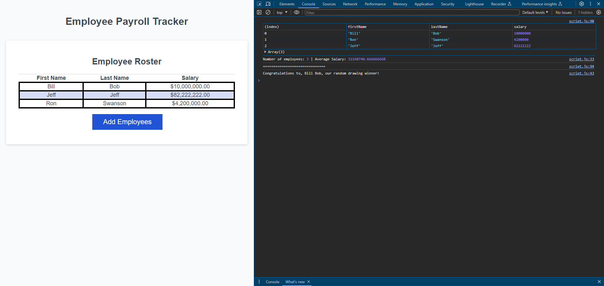

# Payroll-Tracker

## Description
Updated an existing code to fix issues regarding collecting employee data, calculating said data's average salary, and choosing a random winner from the data.

https://github.com/ronhoover97/payroll-tracker

https://ronhoover97.github.io/payroll-tracker/

